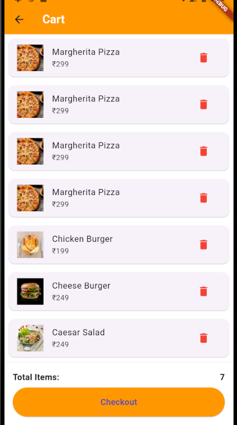
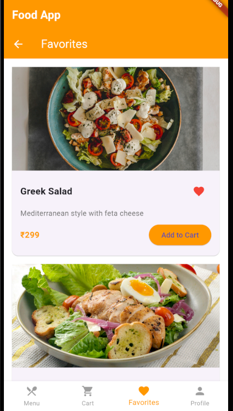
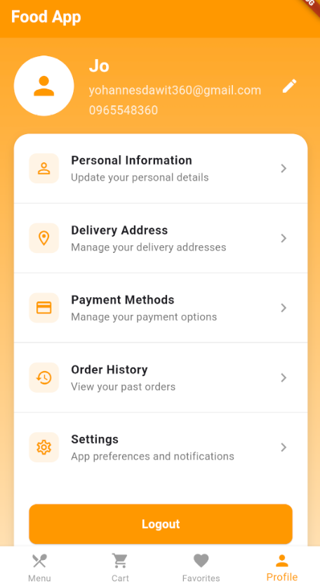
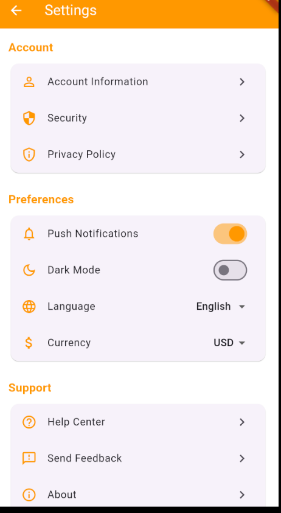

# Enate Bet Food Delivery App

A modern food delivery application built with Flutter.

## Features

- **User Authentication** - Secure login system
- **Home Screen** - Browse featured restaurants and dishes
- **Menu Management** - View detailed menu items
- **Categories** - Browse food by categories
- **Cart Management** - Add items and manage your cart
- **Order History** - Track past and current orders
- **Favorites** - Save your favorite dishes and restaurants
- **Profile Management** - Manage personal information
- **Payment Methods** - Multiple payment options
- **Delivery Address** - Save and manage delivery addresses
- **Notifications** - Stay updated with order status
- **Settings** - Customize app preferences
- **Help & Support** - Get assistance when needed

## Screenshots

Here are some screenshots of the key features of our app:

### Menu Screen

### Cart

### Favorites

### Profile

### Personal Information

### Settings

### Navigation Menu

## Getting Started

1. Clone this repository
2. Run `flutter pub get` to install dependencies
3. Connect a device or emulator
4. Run `flutter run` to start the app

## Technologies Used

- Flutter
- Dart
- Firebase (for backend)
- REST APIs

## Contributing

Contributions are welcome! Please feel free to submit a Pull Request.
